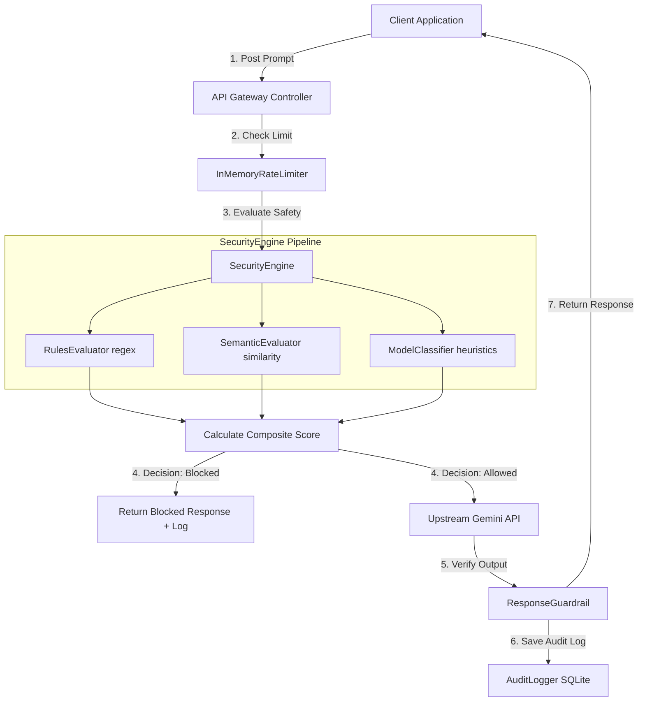

# PromptShield: AI Security Gateway for Large Language Models

[](https://www.python.org/)
[](https://react.dev/)
[](https://fastapi.tiangolo.com/)
[](LICENSE)

**PromptShield** is a production-grade, high-performance AI Security Gateway designed to shield Large Language Models (LLMs) from real-world adversarial attacks. Placed as a reverse proxy between your clients and upstream LLMs (such as Google Gemini), PromptShield performs real-time inspection, threat scoring, rate-limiting, and deep audit logging to ensure secure, compliant AI interactions.

---

## Table of Contents
1. [Project Overview & Problem Statement](#project-overview--problem-statement)
2. [Key Objectives](#key-objectives)
3. [Core Features](#core-features)
4. [System Architecture](#system-architecture)
5. [Technology Stack](#technology-stack)
6. [Installation & Local Setup](#installation--local-setup)
7. [Environment Variables](#environment-variables)
8. [Docker Deployment Guide](#docker-deployment-guide)
9. [REST API Documentation](#rest-api-documentation)
10. [Red Team Security Evaluation](#red-team-security-evaluation)
11. [Security Configurations & RBAC](#security-configurations--rbac)
12. [Walkthrough of Prompt Evaluation Workflow](#walkthrough-of-prompt-evaluation-workflow)
13. [Future Enhancements](#future-enhancements)
14. [License & Contributors](#license--contributors)

---

## Project Overview & Problem Statement

As Large Language Models (LLMs) are increasingly integrated into enterprise applications, they become prime targets for novel security threats. Traditional web application firewalls (WAFs) are blind to semantic attacks. PromptShield addresses this gap by intercepting and evaluating incoming prompts for:
*   **Prompt Injection:** Attempts to hijack the model's core instruction set.
*   **Jailbreaking:** Obfuscation strategies designed to bypass safety guardrails.
*   **System Prompt Extraction & Prompt Leakage:** Social engineering to exfiltrate private developer guidelines.
*   **Harmful Content:** Instructions for generating toxic material, malware, or illegal compounds.
*   **Data Exfiltration:** Malicious attempts to smuggle system tokens, environment configurations, or database records out of network boundaries.

---

## Key Objectives

1.  **Semantic Security:** Intercept and score semantic threats using multi-layered heuristic, regex, and model-based classifiers.
2.  **Rate Limiting:** Protect upstream LLM endpoints from Denial of Service (DoS) and API quota abuse.
3.  **Comprehensive Auditing:** Log every request's raw inputs, outputs, threat risk metrics, and internal gateway decisions for legal and forensic compliance.
4.  **Administrative Observability:** Provide security officers with a high-fidelity control dashboard featuring interactive analytics, configuration switches, and user role management.
5.  **Adversarial Simulation:** Maintain a continuous automated Red Team evaluation suite to benchmark gateway safety policies.

---

## Core Features

*   **Multi-Engine Defense Pipeline:**
    *   *Rules Evaluator:* Fast regex checking for known injection flags.
    *   *Semantic Evaluator:* Vector similarity comparison against a database of known jailbreaks.
    *   *Model Classifier:* Advanced threat category identification using custom safety heuristics.
    *   *Response Guardrail:* Real-time masking and filter rules for downstream model outputs.
*   **Granular Authentication & RBAC:** Secure token-based JWT authentication separating administrative rights (`Admin`) from standard querying users (`User`).
*   **Interactive Analytics Console:** Visualizations of threat distributions, volume over time, and latency metrics using Recharts.
*   **Dynamic Setting Tuning:** Adjust rate limits, risk thresholds, and logging verbosity in real time from the UI without restarting servers.
*   **Automated Red-Teaming Simulator:** Continuous security benchmarker running 200 adversarial test cases across 9 distinct threat categories, complete with CSV/JSON exports.

---

## System Architecture

The following block diagram outlines the data flow through PromptShield:



---

## Technology Stack

### Backend
*   **Framework:** FastAPI (Python 3.11+)
*   **ASGI Server:** Uvicorn
*   **Database ORM:** SQLAlchemy (Asyncio)
*   **Driver:** aiosqlite (SQLite)
*   **Security & JWT:** Passlib (Bcrypt), PyJWT

### Frontend
*   **Build Tool / Framework:** Vite + React 18
*   **Styling:** CSS + Tailwind CSS
*   **Charts & Visuals:** Recharts
*   **Icons:** Lucide React

---

## Installation & Local Setup

### Backend Setup
1. Navigate to the backend directory:
   ```bash
   cd backend
   ```
2. Create and activate a virtual environment:
   ```bash
   python -m venv venv
   # On Windows:
   .\venv\Scripts\activate
   # On Linux/macOS:
   source venv/bin/activate
   ```
3. Install the dependencies:
   ```bash
   pip install -r requirements.txt
   ```
4. Create your `.env` configuration file from the template:
   ```bash
   cp .env.example .env
   ```
5. Seed and start the backend development server:
   ```bash
   python -m uvicorn app.main:app --host 127.0.0.1 --port 8000 --reload
   ```

### Frontend Setup
1. Navigate to the frontend directory:
   ```bash
   cd ../frontend
   ```
2. Install npm packages:
   ```bash
   npm install
   ```
3. Start the Vite React development server:
   ```bash
   npm run dev
   ```
4. Access the web dashboard at `http://localhost:5173`.
5. Log in with the default admin account:
   *   **Username:** `admin`
   *   **Password:** `adminpassword123`

---

## Environment Variables

PromptShield uses the following variables for configuration:

| Variable | Description | Default |
| :--- | :--- | :--- |
| `PROJECT_NAME` | Display name of the application | `"PromptShield Gateway"` |
| `SECRET_KEY` | JWT signing secret key | `"supersecretdevelopmentkeythatisthirtytwobyteslong"` |
| `DATABASE_URL` | SQLite database connection URI | `"sqlite+aiosqlite:///./promptshield.db"` |
| `GEMINI_API_KEY` | Upstream Google Gemini API key | `""` |
| `RATE_LIMIT_WINDOW_SECONDS` | Time window for rate limiting in seconds | `60` |
| `RATE_LIMIT_MAX_REQUESTS` | Allowed requests per window per IP | `10` |
| `RISK_THRESHOLD_MALICIOUS` | Minimum score to block a prompt (0-100) | `70` |
| `RISK_THRESHOLD_SUSPICIOUS` | Minimum score to flag a prompt (0-100) | `30` |
| `LOGGING_LEVEL` | Application logging verbosity | `"INFO"` |

---

## Docker Deployment Guide

### Prerequisites
Make sure you have [Docker](https://www.docker.com/) and [Docker Compose](https://docs.docker.com/compose/) installed on your host system.

### Build and Launch Services
1. Go to the root directory containing `docker-compose.yml`.
2. Configure your external Gemini key in the environment shell:
   ```bash
   ### Configure your Gemini API key

**Linux/macOS**

```bash
export GEMINI_API_KEY="YOUR_GEMINI_API_KEY"
```

**Windows PowerShell**

```powershell
$env:GEMINI_API_KEY="YOUR_GEMINI_API_KEY"
```
   ```
3. Build and launch the containers in detached mode:
   ```bash
   docker-compose up --build -d
   ```
4. Verify running containers:
   ```bash
   docker-compose ps
   ```

### Services Mapping
*   **Web Console Dashboard:** `http://localhost:80` (container nginx maps to host 80)
*   **FastAPI API Swagger Docs:** `http://localhost:8000/docs`
*   **SQLite Volume Data:** Mounted inside `backend_db` named volume mapped to `/app/db_data`.

---

## REST API Documentation

Detailed REST API routing descriptions:

### Gateway Endpoints (`tags: ["AI Security Gateway"]`)
*   `POST /api/v1/gateway/chat` - Submits a prompt for gateway verification and Gemini evaluation.

### Authentication & User RBAC (`tags: ["Authentication & Admin RBAC"]`)
*   `POST /api/v1/auth/login` - Authenticates user credentials and issues JWT token.
*   `GET /api/v1/auth/me` - Retrieves current active user profile details.
*   `GET /api/v1/auth/users` - Lists all registered users (Admin Only).
*   `POST /api/v1/auth/users` - Registers a new user account (Admin Only).
*   `PUT /api/v1/auth/users/{user_id}/role` - Changes user roles (Admin Only).
*   `PUT /api/v1/auth/users/{user_id}/disable` - Activates/Deactivates user accounts (Admin Only).

### Red-Teaming Suite (`tags: ["Red-Teaming Suite"]`)
*   `POST /api/v1/redteam/run` - Triggers a red teaming evaluation suite (Admin Only).
*   `GET /api/v1/redteam/reports` - Lists all historical evaluation run records (Admin Only).
*   `GET /api/v1/redteam/reports/{report_id}` - Retrieves granular test logs for a specific run (Admin Only).
*   `GET /api/v1/redteam/reports/{report_id}/export` - Exports run data as CSV/JSON (Admin Only).

### Threat Logs & System Configuration
*   `GET /api/v1/logs` - Query, filter, and page security audit logs (Admin Only).
*   `GET /api/v1/settings` - Query dynamic configurations (Admin Only).
*   `PUT /api/v1/settings` - Update rate limits, thresholds, and logging level (Admin Only).

---

## Red Team Security Evaluation

The framework includes a built-in automated Red Teaming system. The test runner loops through adversarial inputs in `redteam_dataset.json` and evaluates the `SecurityEngine`'s defensive response.

### Running Tests Automatically
You can execute all system test suites using pytest:
```bash
cd backend
$env:PYTHONPATH="."
.\venv\Scripts\pytest
```

---

## Future Enhancements

1.  **Upstream Load Balancing:** Route traffic across multiple LLM backends (Gemini, OpenAI, Anthropic).
2.  **Distributed Rate Limiting:** Transition from in-memory maps to Redis for stateless cluster support.
3.  **Active Directory / OAuth Integration:** Support standard OAuth2 and Single Sign-On (SSO) protocols.
4.  **Advanced Vector Databases:** Integrate PGVector or Milvus to support millions of semantic jailbreak templates.

---

## License & Contributors

*   **Developer:** Kowsalya (Final Year Project)
*   **License:** MIT License. See [LICENSE](LICENSE) for more details.
